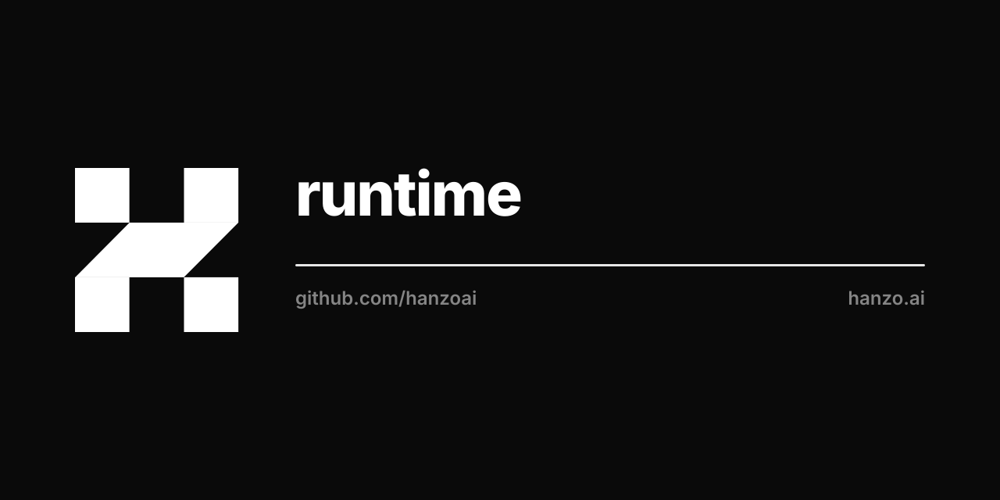

<p align="center"></p>

<div align="center">

[](https://github.com/hanzoai/runtime)

[](https://goreportcard.com/report/github.com/hanzoai/runtime)
[](https://github.com/hanzoai/runtime/issues)


</div>

&nbsp;

<div align="center">
  <h1>Hanzo Runtime</h1>
</div>

<h3 align="center">
  AI Generated Code Execution Runtime
  <br/>
  Secure, Fast, and Scalable Infrastructure for
  AI-Generated Code Execution.
</h3>

<p align="center">
    <a href="https://github.com/hanzoai/runtime"> Documentation </a>·
    <a href="https://github.com/hanzoai/runtime/issues/new?assignees=&labels=bug&projects=&template=bug_report.md&title=%F0%9F%90%9B+Bug+Report%3A+"> Report Bug </a>·
    <a href="https://github.com/hanzoai/runtime/issues/new?assignees=&labels=enhancement&projects=&template=feature_request.md&title=%F0%9F%9A%80+Feature%3A+"> Request Feature </a>·
    <a href="https://hanzo.ai"> Visit Hanzo AI </a>
</p>


---

## Installation

### Python SDK

```bash
pip install hanzo-runtime
```

### TypeScript SDK

```bash
npm install @hanzo/runtime
```

---

## Features

- **Lightning-Fast Infrastructure**: Sub-90ms Sandbox creation from code to execution.
- **Separated & Isolated Runtime**: Execute AI-generated code with zero risk to your infrastructure.
- **Massive Parallelization for Concurrent AI Workflows**: Fork Sandbox filesystem and memory state (Coming soon!)
- **Programmatic Control**: File, Git, LSP, and Execute API
- **Unlimited Persistence**: Your Sandboxes can live forever
- **OCI/Docker Compatibility**: Use any OCI/Docker image to create a Sandbox

---

## Quick Start

1. Create an account at https://hanzo.ai
1. Generate a new API key from your dashboard
1. Start using the Hanzo Runtime SDK

## Creating your first Sandbox

### Python SDK

```py
from hanzo_runtime import HanzoRuntime, HanzoRuntimeConfig, CreateSandboxParams

# Initialize the Hanzo Runtime client
runtime = HanzoRuntime(HanzoRuntimeConfig(api_key="YOUR_API_KEY"))

# Create the Sandbox instance
sandbox = runtime.create(CreateSandboxParams(language="python"))

# Run code securely inside the Sandbox
response = sandbox.process.code_run('print("Sum of 3 and 4 is " + str(3 + 4))')
if response.exit_code != 0:
    print(f"Error running code: {response.exit_code} {response.result}")
else:
    print(response.result)

# Clean up the Sandbox
runtime.remove(sandbox)
```

### Typescript SDK

```jsx
import { HanzoRuntime } from '@hanzo/runtime'

async function main() {
  // Initialize the Hanzo Runtime client
  const runtime = new HanzoRuntime({
    apiKey: 'YOUR_API_KEY',
  })

  let sandbox
  try {
    // Create the Sandbox instance
    sandbox = await runtime.create({
      language: 'python',
    })
    // Run code securely inside the Sandbox
    const response = await sandbox.process.codeRun('print("Sum of 3 and 4 is " + str(3 + 4))')
    if (response.exitCode !== 0) {
      console.error('Error running code:', response.exitCode, response.result)
    } else {
      console.log(response.result)
    }
  } catch (error) {
    console.error('Sandbox flow error:', error)
  } finally {
    if (sandbox) await runtime.remove(sandbox)
  }
}

main().catch(console.error)
```

---

## Contributing

Hanzo Runtime is Open Source under the [GNU AFFERO GENERAL PUBLIC LICENSE](LICENSE). If you would like to contribute to the software, read the Developer Certificate of Origin Version 1.1 (https://developercertificate.org/). Afterwards, navigate to the [contributing guide](CONTRIBUTING.md) to get started.
